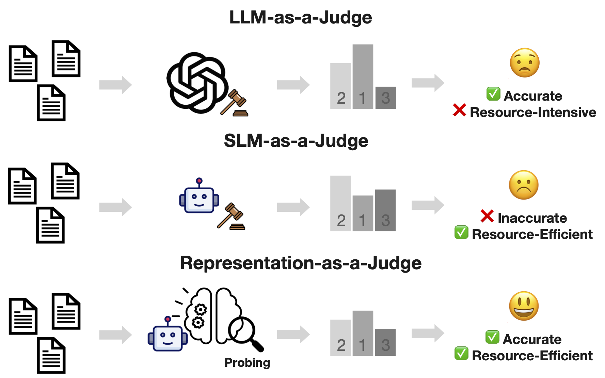
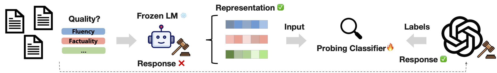

<!-- # <u>IN</u>ternal <u>S</u>ignal <u>P</u>robing and <u>E</u>valua<u>T</u>ion <u>O</u>f <u>R</u>epresentations (INSPECTOR) -->
# Representation-as-a-judge

Repo for the paper: "[Rethinking LLM-as-a-Judge: Representation-as-a-Judge with Small Language Models via Semantic Capacity Asymmetry](https://openreview.net/pdf?id=VAISvCsrvG)", accepted by ICLR 2026.




## Before You Start
This repository aims to provide a plug-and-play reliable evaluators for **reasoning question and prediction pairs(reference-free)**, and to reproduce our paper's work. Since our work is based on public models, datasets and HuggingFace, it is **easy to scale and adapt**. Feel free to scale out for your own tasks!

- Baselines: RoBERTa
- Small Language models: Qwen3-0.6B, Qwen3-1.7B, Llama-3.2-1B-Instruct, Llama-3.1-8B-Instruct
- Large Language models: DeepSeek-V3 
- Datasets: [GSM8K](https://huggingface.co/datasets/openai/gsm8k), [MATH](https://github.com/hendrycks/math), [GPQA](https://huggingface.co/datasets/Idavidrein/gpqa)  

Directory explanation:
- `/{gsm8k/math/gpqa}_{multi/binary}_clfs`: The ready to use trained multiclass or binary classifier on different datasets, based on optimial representations for best evaluation performance. They are based on the LLM Qwen3-1.7B and classifiers in scikit-learn.
- `/local_dataset`: The `cache_dir` of `load_dataset()` for all downloaded datasets.
- `/checkpoints`: The `output_dir` for fine-tuned models as baselines.

## Plug-and-Play
### 1. Requirements
```
pip install -r requirements.txt
```

### 2. Evaluate your question and prediction pairs on reasoning tasks
As we show above, we already uploaded trained classifiers for the datasets used in our paper. However, you can also use them to evaluate similar tasks, such as evaluate SVAMP tasks using our trained GSM8K/MATH classifiers.

The classifiers are based on **Qwen3-1.7B and scikit-learn**, please make sure your resource is compatible with the inference. It supports evaluating the reasoning pairs across 5 aspects ([ROSCOE, ICLR 2023](https://arxiv.org/pdf/2212.07919)): 

**Semantic Consistency, Logicality, Informativeness, Fluency, Factuality**

For each pair, **multiclass classifier will rate 1-5 score** for each aspect, and **binary classifier will rate 0/1 (low quality/high quality) score** for each aspect.

The evaluated results will add scores of these 5 aspects in the dict, and key `"total_score"` to sum up all scores. You can also specify `--top_percent` (defualt=1) to filter top perecent quality data based on `"total_score"`.

We support 2 input formats (but the dict must contain keys `"question"` and `"prediction"`):

-  The input format is a list containing question and prediction pairs:
```
from quick_eval import evaluate_samples

# Your input list
samples = [
    {"question": "What is 2+2?", "prediction": "4"},
    {"question": "What is 3+3?", "prediction": "6"}
]

# Evaluate and get results
results = evaluate_samples(samples, clf_root='gsm8k_multi_clfs', batch_size=16, top_percent=1.0)

# Returns: [
#     {"question": "...", "prediction": "...", 
#      "semantic_consistency": 5, "logicality": 4, 
#      "informativeness": 1, "fluency": 1, "factuality": 5, 
#      "total_score": 16},
#     ...
# ]
```

- The input format is a json file containing similar pairs as above, e.g. [Meta-Llama-3-8B-Instruct_gsm8k_results.json](Meta-Llama-3-8B-Instruct_gsm8k_results.json). This will produce an evaluated json file named like: `Meta-Llama-3-8B-Instruct_gsm8k_results_Qwen3-1.7B_multi_evaled.json`.
```
python quick_eval.py --clf_root 'gsm8k_multi_clfs' --batch_size 16 --file_path 'Meta-Llama-3-8B-Instruct_math_results.json' --top_percent 1.0
```


## Reproduction
If you want to reproduce our results, this part is the step-by-step reproduction guideline from scratch.

### 1. Collect SLM's Responses
This will generate a response file, such as [Meta-Llama-3-8B-Instruct_gsm8k_results.json](Meta-Llama-3-8B-Instruct_gsm8k_results.json).
```
python collect_llm_res_vllm.py --model_path meta-llama/Meta-Llama-3-8B-Instruct --dataset gsm8k
```

### 2. Use LLM to Evaluate the SLM's Responses
Use a LLM to evaluate the SLM's responses in Step 1 and generate 1-5 scores across 5 aspects. It will produce file like [Meta-Llama-3-8B-Instruct_gsm8k_results_roscoe5dim.jsonl](Meta-Llama-3-8B-Instruct_gsm8k_results_roscoe5dim.jsonl). In our experiments, we usee DeepSeek-V3 as the LLM evaluator.
```
python roscoe5dim_multiprocess.py --file_path "Meta-Llama-3-8B-Instruct_gsm8k_results.json" --dataset gsm8k
```

### 3. Generate Probing Dataset from LLM-as-a-Judge Dataset
Based on [Meta-Llama-3-8B-Instruct_gsm8k_results_roscoe5dim.jsonl](Meta-Llama-3-8B-Instruct_gsm8k_results_roscoe5dim.jsonl) of Step 2, it will produce ready-to-use dataset for probing: [Meta-Llama-3-8B-Instruct_gsm8k_roscoe5dim_probing.json](Meta-Llama-3-8B-Instruct_gsm8k_roscoe5dim_probing.json).
```
import random
import json
from collections import defaultdict
from utils import probing_eval_prompt

res = {}
for dim in ['semantic_consistency', 'logicality', 'informativeness', 'fluency', 'factuality']:
    score_sample = defaultdict(list)
    with open('Meta-Llama-3-8B-Instruct_alpaca2_results_roscoe5dim_augmented.jsonl', 'r') as f:
        for line in f:
            sample = json.loads(line)
            if isinstance(sample['roscoe5dim_score'], dict):
                tmp = {}
                combined_prompt = probing_eval_prompt(sample["question"], sample["prediction"], dim)
                tmp['id'] = sample['id']
                tmp['eval_prompt'] = combined_prompt
                tmp['score'] = sample['roscoe5dim_score'][dim]['score']
                score_sample[sample['roscoe5dim_score'][dim]['score']].append(tmp)

    random.seed(731)
    balance_data = []
    for score in score_sample.keys():
        # Downsampling
        balance_data.extend(random.sample(score_sample[score], k=min([len(val) for key, val in score_sample.items()])))
    balance_data.sort(key=lambda x:x['id'])
    
    res[dim] = balance_data
with open('Meta-Llama-3-8B-Instruct_gsm8k_roscoe5dim_probing.json', 'w') as f:
    json.dump(res, f, indent=4)

print([len(res[key]) for key in res])
```

### 4. Probing and Building Classifiers
We have uploaded the probing scripts for different benchmarks: [probing_gsm8k.ipynb](probing_gsm8k.ipynb), [probing_math.ipynb](probing_math.ipynb), [probing_gpqa.ipynb](probing_gpqa.ipynb). You can change different SLMs, aspects, and multi/binary classifiers in it. It's enough to reproduce our results in Figure 3 and Table 10.

### 5. Baselines Reproduction
The following scripts are used to reproduce our baselines results in Figure 3 and Table 10.

RoBERTa tuning has been included at the end of the .ipynb files.

Direct prompt inference for SLMs, e.g. Qwen3-1.7B(Prompt):
```
python prompt_eval.py --model_path Qwen/Qwen3-1.7B --data_path "Meta-Llama-3-8B-Instruct_gsm8k_roscoe5dim_probing.json"
```

Fine-tuning and test SLMs, e.g. Qwen3-0.6B(Tuning):
```
# Fine-tuning
python tuning_lora.py \
  --model_path Qwen/Qwen3-0.6B \
  --data_path "Meta-Llama-3-8B-Instruct_gsm8k_roscoe5dim_probing.json" \
  --aspect "semantic_consistency" \
  --classes "multi" \
  --output_dir "checkpoints/Qwen3-0.6B_gsm8k_multi_semantic_consistency" 

# Test
python tuning_eval.py \
  --model_path Qwen/Qwen3-0.6B \
  --lora_path "checkpoints/Qwen3-0.6B_gsm8k_multi_semantic_consistency" \
  --data_path "Meta-Llama-3-8B-Instruct_gsm8k_roscoe5dim_probing.json" \
  --aspect "semantic_consistency" \
  --classes "multi" 
```

### 6. Abalation Reproduction
This part aim to reproduce the abalation study about SFT on training data filtered by different methods, as Section 5.2 in paper.

Filter data via trained classifiers, based on their total_score. This will produce files named like `Meta-Llama-3-8B-Instruct_gsm8k_results_Qwen3-1.7B_binary_filtered.json`.
```
python filter.py \
  --clf_root "gsm8k_binary_clfs" \
  --data_path "Meta-Llama-3-8B-Instruct_gsm8k_results.json" \
  # If you want to keep all quality data
  --top_percent 1.0 \
  # The clf_root is based on this SLM
  --model_name "Qwen/Qwen3-1.7B"
```

Then, we can use the filtered data to fine-tune and test SLM:
```
# Fine-tuning
python sft_lora.py \
  --model_path "meta-llama/Llama-2-7b-chat-hf" \
  --data_path "Meta-Llama-3-8B-Instruct_gsm8k_results_Qwen3-1.7B_binary_filtered.json" \
  --dataset gsm8k \
  # If only train on the top 20% quality data
  --select 'top' \
  --percent 0.2 \
  --output_dir "checkpoints/Llama-2-7b-chat-hf_gsm8k_Qwen3-1.7B_top20" 

# Test
python test_vllm.py \
  --model_path "meta-llama/Llama-2-7b-chat-hf" \
  --lora_path "checkpoints/Llama-2-7b-chat-hf_gsm8k_Qwen3-1.7B_top20" \
  --dataset gsm8k
```


## Citation
If you find this work helpful, we would appreciate it if you could cite it!
```bibtex
@misc{li2026rethinkingllmasajudgerepresentationasajudgesmall,
      title={Rethinking LLM-as-a-Judge: Representation-as-a-Judge with Small Language Models via Semantic Capacity Asymmetry}, 
      author={Zhuochun Li and Yong Zhang and Ming Li and Yuelyu Ji and Yiming Zeng and Ning Cheng and Yun Zhu and Yanmeng Wang and Shaojun Wang and Jing Xiao and Daqing He},
      year={2026},
      eprint={2601.22588},
      archivePrefix={arXiv},
      primaryClass={cs.CL},
      url={https://arxiv.org/abs/2601.22588}, 
}
```


<!-- [](https://star-history.com/#zhuochunli/Representaion-as-a-judge&Date) -->

